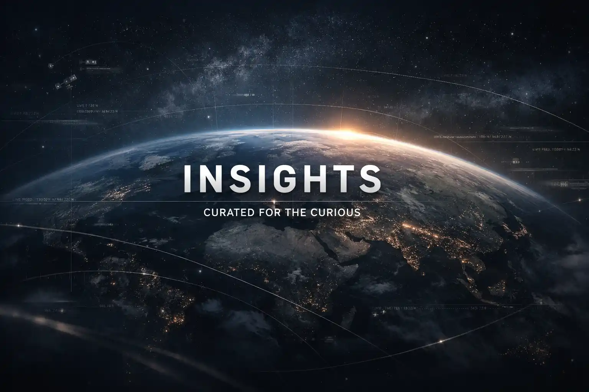
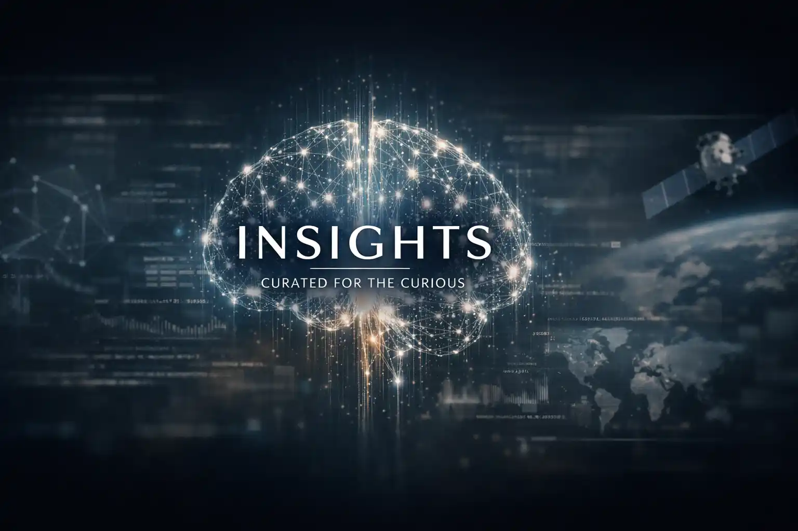

# Hi there 👋

  

Hi — I'm Basava. I hold a PhD in Computational Mechanics from École des Mines de Paris and currently work as a Senior R&D Engineer, with a strong focus on scientific software development. My core expertise lies in building intuitive graphical user interfaces (GUIs), automating complex engineering workflows, and optimizing computational and numerical pipelines. I enjoy bridging the gap between advanced science and practical software by creating efficient, user-friendly tools that support research and engineering teams.

Alongside my core engineering work, I independently explore AI-driven content creation as a technical side initiative, focusing on how modern language models can be used to analyze, summarize, and communicate complex scientific and technological topics more effectively. This work is driven by curiosity and experimentation, and complements my broader interest in scalable, automated knowledge systems.

With a strong foundation in numerical methods, programming, and applied research, I remain deeply interested in emerging technologies and in improving how complex information is processed, presented, and consumed.

---

## My projects

  <h3 style="margin:0"><strong>VU-VERSE</strong></h3>
  

  VU-VERSE is a unified visualization platform for exploring VTK HDF time-series datasets using Visualization Toolkit and its vtkHDF format.

The platform is built around cross-platform parity: the same UI layer, interaction model, and VTK rendering pipeline are shared across native and WebAssembly builds. This ensures consistent behavior, feature availability, and performance characteristics between desktop and web deployments, while preserving high-performance interactive visualization and time-series exploration.
  

    

    <ul>
      <li><a href="https://www.youtube.com/watch?v=I-roFNQmASY">YouTube demo</a></li>
      <li><a href="https://github.com/basavaakula/ScyLab-Tools/releases">Release notes (desktop)</a></li>
      <li><a href="https://basavaakula.github.io/vu-verse/viewer.html">Web viewer</a></li>
      <li><a href="https://basavaakula.github.io/vu-verse/docs_site/index.html">Docs</a></li>
    </ul>
    

  

    
  

  <h3 style="margin:0"><strong>ABR-INSIGHTS</strong></h3>
  

    ABR-INSIGHTS is an AI-native information platform that automatically analyzes and summarizes stories from trusted, publicly available news sources. It delivers concise insights across technology, science, AI, global news and business, and ships extended summaries and multilingual audio briefings in: 🇬🇧 English, 🇫🇷 French, 🇩🇪 German, and 🇪🇸 Spanish.
  

  

    
    
    
  

<!-- VU card -->

  <h3 style="margin:0"><strong>VU</strong></h3>
  

    VU is a web-based application to view and analyze finite element results. The project combines Flask, HDF5, VTK and WebAssembly to provide an interactive visualization experience on both web and desktop targets.
  

    

    <ul>
      <li><a href="https://www.youtube.com/watch?v=IancX0b6ZBI">YouTube demo</a></li>
      <li><a href="https://github.com/basavaakula/ScyLab-Tools/releases">Release notes (desktop)</a></li>
    </ul>
    

  

    
  

---