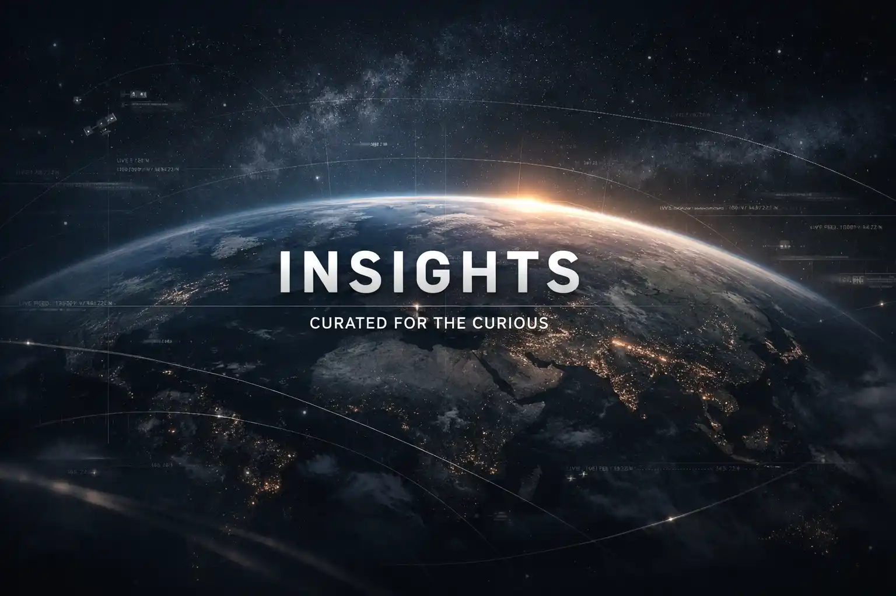

# Hi there 👋

  

I’m a Senior R&D Engineer with a PhD in Computational Mechanics from École des Mines de Paris 🎓. My core expertise lies in building high-performance, web-based software systems that bridge the gap between complex computational science and practical engineering workflows. Professionally, I focus on optimizing graphics rendering systems, automating highly parallel simulation pipelines, and crafting intuitive visual interfaces that make deep technology reliable in real-world environments.

Alongside my corporate R&D work, I architect independent developer tools and automation platforms that span the entire web and cloud stack 🚀. My software portfolio—including my browser-based data visualization engines (VU & VU-VERSE), serverless infrastructure platforms (AntiNode with its amAIra AI proxy), and automated media systems (ABR-INSIGHTS)—is driven by a passion for lean, stateless, and event-driven architectures.

Whether working with web rendering, serverless cloud setups, or automated AI pipelines, my goal remains the same 🛠️: to eliminate repetitive infrastructure friction, keep data secure, and build tools that make development faster and more intuitive.

---

## My Projects

### 🧠 ANTINODE
Antinode: AI-First Backend-as-a-Service for Frontend Developers

Antinode is a managed, AI-first Backend-as-a-Service (BaaS) platform that enables frontend engineers, indie hackers, and product teams to ship production-ready full-stack applications without provisioning servers, managing databases, or maintaining complex backend infrastructure.

Simply integrate the lightweight Antinode SDK and remain entirely frontend-first.

* 🚀 The Flagship Feature: amAIra Native Embeds
Real-time AI experiences shouldn't require a dedicated backend. Antinode brings amAIra directly into the gateway layer. It is a secure, proxy-native AI assistant framework. Configure commercial LLM providers or local Ollama deployments from your dashboard and instantly embed a high-performance streaming chat experience into your application. Antinode handles token streaming, buffering, request orchestration, and delivery natively—allowing conversational AI to be deployed into static websites with a single script tag and zero custom streaming infrastructure.

* 🛡️ Production Infrastructure Included
While amAIra powers user-facing AI experiences, Antinode quietly provides the core services required by modern SaaS applications:
  - 🔒 Identity & IAM: Secure authentication and user session management powered by Google Sign-In under the hood. Your frontend never needs to deal directly with OAuth complexity.
  - 🔑 BYOK Secrets Vault: Store third-party credentials and private API keys securely using Google Cloud Secret Manager. Secrets are loaded only during serverless execution and are never exposed to client applications.
  - 💳 Billing & Stripe Subscriptions: Connect Stripe to provision subscription plans, launch hosted checkouts, process signed webhooks, and provide self-service customer billing portals with minimal configuration.

* 🛡️ Perimeter Protection by Design
Antinode is built around strict cryptographic multi-tenancy and edge-level financial circuit breaking. The gateway acts as an active billing shield, automatically detecting and dropping abusive traffic before requests reach your upstream AI providers, helping protect both service availability and usage-based costs.

> Replace backend complexity with frontend autonomy.

---

### 🌐 VU-VERSE
Unified Visualization Platform for VTK HDF Time-Series Datasets

VU-VERSE is a unified visualization platform for exploring VTK HDF time-series datasets using the Visualization Toolkit and its vtkHDF format.

The platform is built around cross-platform parity: the same UI layer, interaction model, and VTK rendering pipeline are shared across native and WebAssembly builds. This ensures consistent behavior, feature availability, and performance characteristics between desktop and web deployments, while preserving high-performance interactive visualization and time-series exploration.

* Project Links
  - [📺 YouTube Demo](https://www.youtube.com/watch?v=I-roFNQmASY)
  - [🚀 Release Notes (Desktop)](https://github.com/basavaakula/ScyLab-Tools/releases/tag/VU-VERSE)
  - [🌐 Web Viewer](https://basavaakula.github.io/vu-verse/viewer.html)
  - [📚 Documentation](https://basavaakula.github.io/vu-verse/docs_site/index.html)

  

---

### 📰 ABR-INSIGHTS
AI-Native Information Platform

ABR-INSIGHTS is an AI-native information platform that automatically analyzes and summarizes stories from trusted, publicly available news sources. It delivers concise insights across technology, science, AI, global news, and business, and ships extended summaries and multilingual audio briefings in: 🇬🇧 English, 🇫🇷 French, 🇩🇪 German, and 🇪🇸 Spanish.

* Hub Links

  
  
  

---

### 📊 VU
Web-Based Finite Element Results Visualizer

VU is a web-based application to view and analyze finite element results. The project combines Flask, HDF5, VTK, and WebAssembly to provide an interactive visualization experience on both web and desktop targets.

* Project Links
  - [📺 YouTube Demo](https://www.youtube.com/watch?v=IancX0b6ZBI)
  - [🚀 Release Notes (Desktop)](https://github.com/basavaakula/ScyLab-Tools/releases/tag/VU-v1.0.0)

  

---
